# Arsitektur Plugin QGIS GeoNode Connector & Panduan Penyesuaian Multi-Instance GeoNode

Dokumen ini menyajikan dua bagian utama:
1. **Arsitektur Sistem Plugin GeoNode Connector**: Blueprint struktural menyeluruh dari arsitektur perangkat lunak plugin (Presentation, Controller, Background Workers, Business Service, REST API, Domain Model, Caching, dan Utilitas) termasuk pembaruan Model/View `QTableView`, enkripsi `QgsAuthManager`, GeoPackage (.gpkg) cache, eliminasi dependensi biner `psycopg2` via `QgsDataSourceUri`, dan WFS-T per-user.
2. **Panduan Penyesuaian Multi-Instance, Delta Sync & Distribusi Multi-Device**: Penjelasan penyelesaian selisih dataset 520 vs 522, migrasi kredensial sensitif ke `QgsAuthManager`, mekanisme *Delta Sync*, manajemen multi-instance dinamis via `QgsSettings`, serta panduan instalasi ke komputer/laptop lain lintas sistem operasi.

---

# BAGIAN 1: ARSITEKTUR PLUGIN GEONODE CONNECTOR

Plugin ini dirancang dengan prinsip **Clean Architecture / Layered Architecture** yang memisahkan antarmuka pengguna (Qt UI), orkestrasi aksi (Controller), background thread workers (QThread), logika bisnis (Business Service), komunikasi jaringan (REST API Client), persistensi cache lokal, dan model domain.

```mermaid
flowchart TD
    subgraph UI_Layer ["1. Presentation Layer (Qt / QGIS UI)"]
        Dialog["GeoNodeConnectorDialog (Main Window)"]
        W_Login["LoginWidget (Server Dropdown + QgsSettings)"]
        W_Dataset["DatasetWidget (QTableView + Virtual Rendering)"]
        W_MyLayers["MyLayersWidget"]
        W_Activity["ActivityWidget"]
        W_Server["ServerWidget (Multi-Instance Dropdown)"]
        W_About["AboutWidget"]
        D_Upload["UploadWizardDialog"]
        D_Metadata["MetadataDialog"]
        D_Sync["SyncDialog / ChangeDetailDialog"]
    end

    subgraph MV_Layer ["2. Model/View & Proxy Architecture"]
        M_Table["DatasetTableModel (QAbstractTableModel)"]
        M_Proxy["DatasetProxyModel (QSortFilterProxyModel - C++ Filter)"]
    end

    subgraph Controller_Layer ["3. Controller / Presenter Layer"]
        C_Login["LoginController"]
        C_Dataset["DatasetController (Non-blocking async + Delta Sync)"]
        C_Import["ImportController"]
        C_Server["ServerController (QgsSettings Multi-Instance Sync)"]
        C_About["AboutController"]
    end

    subgraph Worker_Layer ["4. Background Concurrency Layer (Non-blocking)"]
        WK_Fetch["DatasetFetchWorker (QThread - Full / Delta Pagination)"]
    end

    subgraph Service_Layer ["5. Business Service Layer"]
        S_Login["LoginService"]
        S_Layer["LayerService (Delta Sync + GPKG Cache Manager)"]
        S_Import["ImportService (Native GPKG / WFS / WMS)"]
        S_Sync["SyncService (Per-User WFS-T Transactions + Native QgsDataSourceUri)"]
        S_Upload["UploadService"]
        S_Meta["MetadataService"]
        S_Act["ActivityService"]
    end

    subgraph Cache_Layer ["6. Local Persistence & Standardized Cache"]
        DiskCache[("datasets_cache.json (Instant Startup <0.05s - 522 Datasets)")]
        GpkgCache["cache/gpkg/ (*.gpkg - SQLite + R-Tree Spatial Index)"]
        GeoJsonCache["cache/geojson/"]
        ShpCache["cache/shapefiles/"]
    end

    subgraph Security_Layer ["7. Security & Authentication Architecture"]
        Auth_Mgr["AuthManagerService (QgsAuthManager - Master Password Encryption)"]
        Auth_Cfg[("QGIS Auth Database: qgis-auth.db")]
    end

    subgraph API_Layer ["8. Data Access & API Layer"]
        A_Auth["AuthAPI (/o/token/, /api/v2/users/)"]
        A_Dataset["DatasetAPI (/api/v2/datasets + Supplementary /api/v2/resources)"]
        A_Upload["UploadAPI (/api/v2/uploads)"]
        A_Meta["MetadataAPI (/api/v2/datasets/{pk})"]
        GS_Rest["GeoServer REST API (/geoserver/rest)"]
        GS_WFST["GeoServer OWS WFS-T HTTP Transaction Engine"]
        QGS_Uri["QgsDataSourceUri (Native QGIS PostgreSQL Provider)"]
    end

    subgraph Core_Layer ["9. Models & State Management"]
        M_Session["Session Singleton (Token, User, Server)"]
        M_Layer["Layer Model (Metadata, BBox, OWS URLs, modified)"]
        M_User["User Model"]
        M_Result["ServiceResult (ok/fail wrapper)"]
    end

    subgraph Remote_Host ["10. GeoNode & Geospatial Servers"]
        QGIS_Canvas["QGIS Canvas / QgsProject"]
        GeoNode_Server["GeoNode 4.x / 5.x Web Server"]
        GeoServer_Engine["GeoServer Engine"]
        PostGIS_DB["PostgreSQL / PostGIS Database"]
    end

    %% Relasi Antar Layer
    Dialog --> W_Login & W_Dataset & W_MyLayers & W_Activity & W_Server & W_About
    W_Dataset --> M_Proxy --> M_Table
    W_Login --> C_Login
    W_Dataset --> C_Dataset
    W_Server --> C_Server

    C_Login --> S_Login
    C_Login --> Auth_Mgr
    Auth_Mgr --> Auth_Cfg
    C_Dataset --> S_Layer
    C_Dataset --> WK_Fetch
    WK_Fetch --> A_Dataset
    C_Dataset --> C_Import
    C_Import --> S_Import

    S_Layer --> DiskCache
    S_Layer --> A_Dataset
    S_Login --> A_Auth
    S_Import --> QGIS_Canvas
    S_Import --> GpkgCache
    S_Import -.->|WFS / WMS URI| GeoServer_Engine

    S_Sync --> GS_WFST
    S_Sync --> QGS_Uri
    S_Sync --> GS_Rest
    QGS_Uri --> PostGIS_DB
    GS_WFST --> GeoServer_Engine
    GS_Rest --> GeoServer_Engine

    S_Upload --> A_Upload
    S_Upload --> S_Sync
    S_Meta --> A_Meta
```



---

## 1.1 Rincian Layer Arsitektur & Peningkatan Performa

### 1. Presentation Layer (`ui/widgets/`, `ui/dialogs/`)
* **`GeoNodeConnectorDialog`**: Window utama (`QMainWindow`) yang menampung header status koneksi, navigasi tab horizontal, serta `QStackedWidget`.
* **`DatasetWidget` (Model/View `QTableView` & Virtual Rendering)**:
  * Menggantikan implementasi legacy `QTableWidget` dengan **`QTableView`** yang dipadukan dengan **`QSortFilterProxyModel`**.
  * **Virtual Rendering**: QGIS hanya merender baris yang tampak pada layar (viewport), mengeliminasi alokasi ribuan object C++ `QTableWidgetItem` yang boros memori.
  * **C++ Native Filtering (0ms latency)**: Penyaringan teks pencarian berjalan di level native C++ pada proxy model tanpa iterasi manual Python `setRowHidden()`.
* **`LoginWidget`**: Form autentikasi yang terhubung ke `QgsSettings` untuk pemilihan server secara dinamis.
* **`ServerWidget`**: Form konfigurasi server multi-instance dengan elemen **`QComboBox` preset server** yang terikat ke `QgsSettings`, mendukung perpindahan instan antar-lingkungan server tanpa mengedit file kode.
* **`UploadWizardDialog`**: Wizard dialog modern untuk **Ekspor & Publikasi Dataset Baru** atau pembaruan dataset ke GeoNode:
  * **Sumber Fleksibel**: Pengguna dapat memilih layer yang sedang aktif di kanvas QGIS (`QgsVectorLayer`) maupun memilih file data spasial dari disk (`.gpkg`, `.shp`, `.geojson`) via *file browser*.
  * **Ringkasan Otomatis Layer**: Menampilkan nama layer, tipe geometri (*Point/Line/Polygon*), jumlah fitur, dan sistem koordinat (*CRS/EPSG*).
  * **Standarisasi Format**: Mendukung ekspor ke format GeoPackage (.gpkg - direkomendasikan), GeoJSON, dan Shapefile.
  * **Penyelarasan Style Simbologi (.sld)**: Mendukung ekspor otomatis simbologi layer QGIS ke format OGC Styled Layer Descriptor (`.sld`) dan menjadikannya default style aktif di GeoNode/GeoServer, serta menyediakan tombol ekspor file `.sld` lokal ke komputer.
  * **Layout Responsif & Bebas Horizontal Scroll**: Dialog berukuran pas (*fit*) dengan `ScrollBarAlwaysOff` secara horizontal dan kebijakan penyesuaian konten adaptif.
  * **Pengisian Metadata Standar**: Validasi dan pengisian metadata berstandar SNI/ISO 19115 (Judul, Abstrak, Kategori Tema GeoNode, Kata Kunci, Lisensi, Bahasa).
  * **Monitoring Non-Blocking**: Progress bar interaktif saat mengunggah ke GeoNode Importer (`/uploads/upload`), menyelaraskan style SLD, dan menyegarkan katalog.
* **`ServerWidget` (Aesthetically Modernized Input)**: Form konfigurasi koneksi dengan *input field* timeout yang bersih tanpa tombol stepper panah (`QAbstractSpinBox.NoButtons`), memberikan tampilan minimalis dan elegan.
* **`SyncDialog` & `ChangeDetailDialog`**: Dialog preview dan validasi sebelum melakukan commit atribut/geometri melalui protokol WFS-T.

### 2. Model/View Architecture (`ui/models/dataset_table_model.py`)
* **`DatasetTableModel` (`QAbstractTableModel`)**: Model data tabular murni yang menyajikan kolom PK, Judul Layer, Nama Alternatif, Tipe/Subtype, Status, dan Tanggal Update secara efisien.
* **`DatasetProxyModel` (`QSortFilterProxyModel`)**: Layer proxy di atas model tabel yang menangani sorting multi-kolom dan filtering pencarian instan case-insensitive.

### 3. Concurrency Layer (`services/dataset_worker.py`)
* **`DatasetFetchWorker` (`QThread`)**: Mengambil dataset GeoNode secara asinkron di thread terpisah.
* Mendukung mode **Full Fetch** maupun **Delta Sync** (`since_timestamp`), memancarkan sinyal `pageLoaded(accumulated, count, total)` secara bertahap.

### 4. Business Service Layer (`services/`)
* **`LayerService`**:
  * Mengatur in-memory cache dan **Persistent Disk Cache** (`cache/datasets_cache.json` dengan total 522 dataset).
  * Menyediakan fungsi `sync_delta()` untuk validasi timestamp modifikasi terakhir (`last_modified`) dan penggabungan dataset incremental (`merge_layers`).
* **`SyncService` (Per-User WFS-T & Native `QgsDataSourceUri`)**:
  * **Per-User WFS-T Transactions**: Seluruh transaksi pengeditan (Insert, Update, Delete fitur dan geometri) dialihkan melalui protokol WFS-T GeoServer berbasis hak akses akun masing-masing pengguna di GeoNode.
  * **Eliminasi `psycopg2` via `QgsDataSourceUri`**: Pustaka eksternal `psycopg2` dieliminasi sepenuhnya. Inspeksi tabel dilakukan langsung melalui provider native QGIS `"postgres"` dengan connection pooling bawaan C++ yang stabil di Windows, macOS, dan Linux.
* **`ImportService` (GeoPackage Standardization)**:
  * Mendukung standardisasi cache vektor lokal ke format tunggal **GeoPackage (.gpkg)** via `QgsVectorFileWriter.writeAsVectorFormatV3()`.

### 5. Security & Authentication Layer (`utils/auth_manager.py`)
* **`AuthManagerService` (`QgsAuthManager`)**:
  * Mengenkripsi kredensial pengguna (username, token, password) ke basis data autentikasi QGIS (`qgis-auth.db`) yang terlindungi *Master Password*.
  * Menghilangkan risiko kebocoran file teks biasa `.env` pada saat plugin didistribusikan ke komputer staf.

---

# BAGIAN 2: PANDUAN MENGHUBUNGKAN KE GEONODE LAIN & MULTI-DEVICE

---

## 2.1 Analisis & Solusi Discrepancy Jumlah Dataset (520 vs 522)

### Akar Masalah:
1. Endpoint standar GeoNode `/api/v2/datasets` hanya mengembalikan objek yang terdaftar di tabel `layers_dataset` (layer 2D standard), dengan jumlah total **520** layer.
2. Katalog publik Geoportal (`/catalogue/`) menampilkan **522** dataset karena menghitung seluruh sumber daya di tabel `base_resourcebase` dengan filter `resource_type = 'dataset'`.
3. Terdapat resource spasial non-2D seperti **PK 619 (`masjid_kotagede`)** bertipe **3D Tiles (`subtype: 3dtiles`)** yang disimpan di `base_resourcebase` tetapi tidak masuk ke dalam katalog 2D `/api/v2/datasets`.

### Solusi yang Diimplementasikan:
* Di [`api/dataset.py`](file:///home/alif/.local/share/QGIS/QGIS3/profiles/default/python/plugins/geonode_connector/api/dataset.py), metode `get_datasets()` kini melakukan supplementary fetch ke endpoint `/api/v2/resources?filter{resource_type}=dataset` untuk menangkap resource non-standar (seperti 3D Tiles) yang belum tercakup di endpoint `/api/v2/datasets`.
* Hasil gabungan dipetakan ke model [`Layer`](file:///home/alif/.local/share/QGIS/QGIS3/profiles/default/python/plugins/geonode_connector/models/layer.py) sehingga total dataset yang ditampilkan di plugin menjadi **522**, identik 100% dengan katalog Geoportal.

---

## 2.2 Migrasi Keamanan Kredensial ke `QgsAuthManager`

Penyimpanan kredensial pada file teks biasa `.env` rentan terekspos saat folder plugin disalin ke laptop staf. Plugin telah dimigrasikan menggunakan modul bawaan **`QgsAuthManager`**:

1. **Enkripsi Master Password**: Kredensial akun GeoNode disimpan di database autentikasi terenkripsi QGIS (`qgis-auth.db`).
2. **Koneksi WFS / OWS Terautentikasi**: Parameter `authcfg` dapat langsung disematkan ke URI layer WFS/WMS tanpa mengekspos token atau password dalam teks biasa.
3. **Fallback `.env`**: Untuk kebutuhan server headless / otomatisasi, konfigurasi `.env` tetap didukung sebagai opsi sekunder.

---

## 2.3 Pembatasan Akses SQL Langsung & Alih Jalur ke Per-User WFS-T

Untuk memenuhi standar keamanan *Principle of Least Privilege*:
1. **Akses SQL Superuser Ditiadakan untuk Pengeditan**:
   * Akun superuser basis data tidak lagi digunakan untuk operasi perubahan data sehari-hari.
2. **Transaksi WFS-T Berbasis Akun GeoNode Pengguna**:
   * Seluruh modifikasi fitur (tambah, perbarui nilai atribut, modifikasi geometri, hapus fitur) dikirimkan melalui transaksi HTTP WFS-T (`<wfs:Transaction>`) ke GeoServer.
   * GeoServer memvalidasi izin edit berdasarkan akun pengguna GeoNode yang sedang aktif, sehingga audit trail di GeoNode tetap tercatat rapi dan risiko manipulasi basis data mentah dapat dicegah.

---

## 2.4 Standarisasi Format Cache Lokal ke GeoPackage (.gpkg)

Format cache lokal yang sebelumnya terbagi antara Shapefile dan GeoJSON kini distandarisasi ke format tunggal **GeoPackage (.gpkg)**:

| Fitur | Shapefile (.shp) | GeoJSON (.json) | **GeoPackage (.gpkg)** (Standar Baru) |
| :--- | :--- | :--- | :--- |
| **Batasan Ukuran** | Maksimum 2 GB | Lambat untuk file >50 MB | **Tidak terbatas (SQLite basis)** |
| **Indeks Spasial** | Terpisah (.sidx) | Tidak ada | **Terintegrasi (R-Tree Native)** |
| **Nama Kolom** | Terpotong 10 Karakter | Bebas | **Bebas (Mendukung nama atribut panjang)** |
| **Jumlah File** | Banyak (.shp, .dbf, .shx, .prj) | 1 file teks | **1 file database tunggal terstruktur** |
| **Kecepatan Render QGIS** | Cukup cepat | Lambat (parsing teks) | **Sangat cepat (native C++ SQLite driver)** |

File GeoPackage disimpan di direktori portabel `cache/gpkg/<layer_name>.gpkg`.

---

## 2.5 Efisiensi Jaringan: Mekanisme Delta Sync & Multi-Instance Dropdown

### 1. Delta Sync Berbasis Timestamp Modifikasi (`last_modified`)
* Saat plugin dibuka dan cache lokal sudah ada (522 layer), sistem tidak mengunduh ulang seluruh dataset dari jaringan.
* Background worker menjalankan **Delta Sync** dengan query timestamp:
  `/api/v2/datasets?filter{date_modified.gte}=<last_modified_timestamp>`
* Jika tidak ada data yang berubah di server, respons berukuran minimal (0 overhead jaringan).
* Jika ada layer baru atau yang baru diperbarui, hanya layer tersebut yang ditarik dan digabungkan (`merge_layers`) ke dalam database lokal.

### 2. Multi-Instance Management Dinamis via `QgsSettings`
* Server target tidak lagi dikunci di file statis.
* Pengguna dapat memilih profil instance langsung melalui dropdown di antarmuka tab **PENGATURAN**:
  * `GeoNode Beta (https://geonode-beta.jogjakota.go.id)`
  * `GeoNode Produksi (https://geoportal.jogjakota.go.id)`
  * `GeoNode Lokal (http://localhost:8000)`
* Pilihan tersimpan secara persisten di **`QgsSettings`** dan otomatis menyelaraskan form login.

---

## 2.6 Panduan Pemasangan Plugin di Komputer/Laptop Lain

### 1. Salin Folder Plugin ke Direktori QGIS Target
Salin folder `geonode_connector` ke direktori profil QGIS pengguna di komputer tujuan:

* **Windows:**
  ```text
  %APPDATA%\QGIS\QGIS3\profiles\default\python\plugins\geonode_connector
  (Contoh: C:\Users\<NamaUser>\AppData\Roaming\QGIS\QGIS3\profiles\default\python\plugins\geonode_connector)
  ```
* **Linux:**
  ```text
  ~/.local/share/QGIS/QGIS3/profiles/default/python/plugins/geonode_connector
  ```
* **macOS:**
  ```text
  ~/Library/Application Support/QGIS/QGIS3/profiles/default/python/plugins/geonode_connector
  ```

### 2. Aktifkan Plugin di QGIS
1. Buka **QGIS Desktop**.
2. Masuk ke menu **Plugins** > **Manage and Install Plugins...**.
3. Pada tab **Installed**, aktifkan tanda centang pada **GeoNode Connector**.
4. Panel dock widget **GeoNode Connector** akan muncul.
5. Pilih server target dari dropdown (atau masukkan URL GeoNode).
6. Masukkan kredensial akun GeoNode Anda dan klik **LOGIN**.
7. Seluruh **522 dataset** akan langsung tampil instan (<0.05 detik).

---

## 2.7 Checklist Verifikasi

- [x] Seluruh **522 dataset** muncul presisi di katalog plugin (sesuai geoportal).
- [x] Rendering tabel menggunakan `QTableView` + `DatasetTableModel` (virtual rendering).
- [x] Pencarian instan sisi klien berjalan via `QSortFilterProxyModel` di level C++.
- [x] Format cache vektor lokal distandarisasi ke **GeoPackage (.gpkg)**.
- [x] Inspeksi basis data PostGIS menggunakan provider bawaan `QgsDataSourceUri` (bebas dependensi eksternal `psycopg2`).
- [x] Transaksi edit data dialihkan ke **WFS-T HTTP** berbasis akun pengguna.
- [x] Kredensial sensitif mendukung enkripsi **`QgsAuthManager`** dengan Master Password.
- [x] Mekanisme **Delta Sync** aktif di background thread untuk efisiensi jaringan.
- [x] Multi-instance dropdown terhubung ke **`QgsSettings`**.
