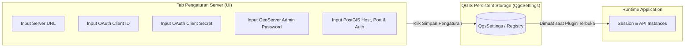

# Arsitektur Plugin QGIS GeoNode Connector & Panduan Penyesuaian Multi-Instance GeoNode

Dokumen ini menyajikan dua bagian utama:
1. **Arsitektur Sistem Plugin GeoNode Connector**: Blueprint struktural menyeluruh dari arsitektur perangkat lunak plugin (Presentation, Controller, Business Service, REST API, Domain Model, dan Utilitas).
2. **Panduan Penyesuaian untuk Instance GeoNode Lain**: Langkah-langkah detail, daftar file, parameter konfigurasi yang perlu disesuaikan, serta konfigurasi sisi server GeoNode target agar plugin dapat bekerja mulus di lingkungan baru.

---

# BAGIAN 1: ARSITEKTUR PLUGIN GEONODE CONNECTOR

Plugin ini dirancang dengan prinsip **Clean Architecture / Layered Architecture** yang memisahkan antarmuka pengguna (Qt UI), orkestrasi aksi (Controller), logika bisnis (Business Service), komunikasi jaringan (REST API Client), dan persistensi/model domain.

```mermaid
flowchart TD
    subgraph UI_Layer ["1. Presentation Layer (Qt / QGIS UI)"]
        Dialog["GeoNodeConnectorDialog (Main Window)"]
        W_Login["LoginWidget"]
        W_Dataset["DatasetWidget"]
        W_MyLayers["MyLayersWidget"]
        W_Activity["ActivityWidget"]
        W_Server["ServerWidget"]
        W_About["AboutWidget"]
        D_Upload["UploadWizardDialog"]
        D_Metadata["MetadataDialog"]
        D_Sync["SyncDialog / ChangeDetailDialog"]
    end

    subgraph Controller_Layer ["2. Controller / Presenter Layer"]
        C_Login["LoginController"]
        C_Dataset["DatasetController"]
        C_Import["ImportController"]
        C_Server["ServerController"]
        C_About["AboutController"]
    end

    subgraph Service_Layer ["3. Business Service Layer"]
        S_Login["LoginService"]
        S_Layer["LayerService"]
        S_Import["ImportService"]
        S_Sync["SyncService"]
        S_Upload["UploadService"]
        S_Meta["MetadataService"]
        S_Act["ActivityService"]
    end

    subgraph API_Layer ["4. Data Access & API Layer"]
        A_Auth["AuthAPI (/o/token/, /api/v2/users/)"]
        A_Dataset["DatasetAPI (/api/v2/datasets)"]
        A_Upload["UploadAPI (/api/v2/uploads)"]
        A_Meta["MetadataAPI (/api/v2/datasets/{pk})"]
        GS_Rest["GeoServer REST API (/geoserver/rest)"]
        PG_Direct["Direct PostGIS Driver (psycopg2)"]
    end

    subgraph Core_Layer ["5. Models & State Management"]
        M_Session["Session Singleton (Token, User, Server)"]
        M_Layer["Layer Model (Metadata, BBox, OWS URLs)"]
        M_User["User Model"]
        M_Result["ServiceResult (ok/fail wrapper)"]
    end

    subgraph Infra_Layer ["6. Infrastructure & Utilities"]
        U_Net["NetworkClient (urllib / requests wrapper)"]
        U_Cfg["config.py (Endpoints, Constants)"]
        U_Set["PluginSettings (QgsSettings)"]
        U_Log["logger.py (Rotating Log)"]
        U_Val["validator.py (URL, Format, Schema)"]
    end

    subgraph QGIS_Host ["7. QGIS & External Servers"]
        QGIS_Canvas["QGIS Canvas / QgsProject"]
        GeoNode_Server["GeoNode 4.x / 5.x Web Server"]
        GeoServer_Engine["GeoServer (WMS, WFS, WFS-T)"]
        PostGIS_DB["PostgreSQL / PostGIS Database"]
    end

    %% Relasi Antar Layer
    Dialog --> W_Login & W_Dataset & W_MyLayers & W_Activity & W_Server & W_About
    W_Login --> C_Login
    W_Dataset --> C_Dataset
    W_Server --> C_Server

    C_Login --> S_Login
    C_Dataset --> S_Layer
    C_Dataset --> C_Import
    C_Import --> S_Import

    S_Login --> A_Auth
    S_Layer --> A_Dataset
    S_Import --> QGIS_Canvas
    S_Import -.->|WFS / WMS URI| GeoServer_Engine
    S_Sync --> GS_Rest
    S_Sync --> PG_Direct
    S_Upload --> A_Upload
    S_Upload --> S_Sync
    S_Meta --> A_Meta

    A_Auth & A_Dataset & A_Upload & A_Meta --> U_Net
    U_Net --> GeoNode_Server
    PG_Direct --> PostGIS_DB
    GS_Rest --> GeoServer_Engine

    S_Login & S_Import & S_Sync & S_Upload --> M_Session
    S_Layer & S_Import & S_Sync --> M_Layer
    Service_Layer --> M_Result
    Controller_Layer & Service_Layer & API_Layer --> U_Cfg
    Controller_Layer & S_Login --> U_Set
    Service_Layer --> U_Log
```



---

## 1.1 Rincian Layer Arsitektur

### 1. Presentation Layer (`ui/widgets/`, `ui/dialogs/`)
Bertanggung jawab merender antarmuka pengguna berbasis PyQt/PyQGIS:
* **`GeoNodeConnectorDialog`**: Window utama (`QMainWindow`) yang menampung header status koneksi, navigasi tab horizontal (`NavScrollArea`), serta `QStackedWidget`.
* **`LoginWidget`**: Form autentikasi (Server URL, Username, Password, Remember Me).
* **`DatasetWidget`**: Katalog pencarian dataset, filter tipe data (Vector / Raster / Semua), paginasi, tombol aksi (Unduh/Impor, Detail, Salin Link).
* **`MyLayersWidget`**: Panel layer khusus milik user yang sedang login, indikator status publish/private, dan akses cepat sinkronisasi.
* **`ServerWidget`**: Form konfigurasi server (Server URL, Timeout request, opsi verifikasi SSL) dengan fitur **Uji Koneksi Server**.
* **`ActivityWidget`**: Tampilan log audit aktivitas lokal (riwayat import, sinkronisasi, upload).
* **`UploadWizardDialog`**: Wizard dialog pengunggahan dataset (ekspor layer QGIS aktif ke GeoPackage/Shapefile/GeoJSON, opsi upload baru vs update layer lama).
* **`SyncDialog` & `ChangeDetailDialog`**: Dialog preview sebelum commit perubahan atribut/geometri/skema dari QGIS ke GeoNode.

### 2. Controller Layer (`ui/controllers/`)
Memisahkan UI dari Business Service (pola MVC / MVP):
* Menghubungkan signal Qt (misal `btn_login.clicked`, `search_input.textChanged`) ke pemanggilan service asynchronous.
* Mengupdate status visual (menampilkan spinner/progress bar, pesan toast/alert, refresh table).

### 3. Business Service Layer (`services/`)
Menjalankan logika bisnis inti aplikasi tanpa ketergantungan langsung ke elemen antarmuka:
* **`LoginService`**: Mengorkestrasi verifikasi koneksi, pertukaran credential dengan token OAuth2, penyimpanan session, dan refresh token berkala.
* **`LayerService`**: Mengatur in-memory cache daftar layer GeoNode, pencarian cepat, filtering, dan sorting.
* **`ImportService`**:
  * **WFS-T Import**: Merakit URI WFS QGIS (`url='...' typename='...' auth...`), memuat layer ke `QgsProject`, dan mengaktifkan mode editable (`setReadOnly(False)`).
  * **WMS Import**: Merakit URI WMS untuk dataset raster dan menambahkan `QgsRasterLayer`.
  * **Direct Vector Import**: Fallback pengunduhan GeoJSON via OGR dan Shapefile ZIP lokal ke direktori cache plugin.
* **`SyncService`**:
  * Mendeteksi delta perubahan fitur di QGIS (`layer.editBuffer()`).
  * Mendeteksi perubahan skema (deteksi kolom baru yang dibuat pengguna di QGIS).
  * Menjalankan commit melalui WFS-T standar GeoServer.
  * Memiliki mekanisme **Direct PostGIS Sync** via `psycopg2` untuk injeksi skema baru dan reload katalog GeoServer (`/geoserver/rest/reset`).
* **`UploadService`**: Mengekspor layer aktif QGIS ke format transfer (`.gpkg`, `.geojson`, `.shp`), mengunggah via REST API GeoNode atau pipeline sinkronisasi langsung.
* **`MetadataService`**: Manajemen pembacaan dan update metadata standar ISO 19115.
* **`ActivityService`**: Pencatatan riwayat transaksi pengguna ke SQLite/JSON lokal.

### 4. Data Access & API Layer (`api/`)
Abstraksi komunikasi HTTP REST API murni (tanpa logika UI):
* **`AuthAPI`**: Endpoint discovery (`/o/token/`, `/api/o/token/`), pertukaran token Password Grant, inspeksi pengguna `/api/v2/users/`.
* **`DatasetAPI`**: Komunikasi dengan endpoint GeoNode `/api/v2/datasets`, query parameter pagination (`page`, `page_size`, `filter{title.icontains}`), dan pemetaan JSON response ke objek domain `Layer`.
* **`UploadAPI`**: Multi-part form data upload ke `/api/v2/uploads` serta polling status task komputasi GeoNode.
* **`MetadataAPI`**: PATCH payload atribut metadata ke `/api/v2/datasets/{pk}/`.

### 5. Domain Models & State (`models/`)
* **`Session` (Singleton)**: Menyimpan state sesi aktif runtime: `server_url`, `access_token`, `refresh_token`, `username`, `is_authenticated`, profil `User`.
* **`Layer`**: Struktur entitas layer spasial (ID, PK, Title, Alternate/Typename, Workspace, Geometry Type, Bounding Box, SRID, WMS URL, WFS URL, Metadata).
* **`ServiceResult`**: Pola standardized result object (`success`, `message`, `data`, `errors`) untuk komunikasi seragam antara service dan controller.

### 6. Infrastructure & Utilities (`utils/`)
* **`network.py`**: Wrapper HTTP client dengan integrasi auth header Bearer, auto-retry, penanganan SSL, timeout handling, dan decoding JSON.
* **`config.py`**: Pusat konfigurasi default, URL endpoint, timeout, dan kredensial bawaan.
* **`settings.py`**: Wrapper `QgsSettings` untuk persistensi preferensi user ke profil QGIS lokal.
* **`logger.py`**: Centralized rotating logging ke file `geonode_connector.log`.

---

# BAGIAN 2: PANDUAN MENGHUBUNGKAN KE GEONODE LAIN

Saat ini, plugin memiliki beberapa nilai konfigurasi yang disesuaikan dengan instance lokal pengembangan (`http://localhost`, IP Docker internal `172.19.0.2`, dan kredensial OAuth default).

Jika Anda ingin menghubungkan plugin ini ke instance GeoNode lain (misalnya server staging, GeoNode internal kantor, atau geoportal production publik berdomain resmi), berikut adalah panduan lengkap apa saja yang **harus disesuaikan**.

---

## 2.1 Matriks Komponen yang Perlu Disesuaikan

| No | Komponen | File Terkait | Kondisi Saat Ini (Default) | Penyesuaian untuk GeoNode Lain |
|:---|:---|:---|:---|:---|
| **1** | **Server URL & Protokol** | `utils/config.py` & UI Tab Server | `http://localhost` | Ganti ke URL target (misal `https://geoportal.namakota.go.id`). |
| **2** | **OAuth2 Client ID & Secret** | `utils/config.py` | Nilai hardcoded instance lokal | Wajib dibuat di Django Admin GeoNode target, lalu diinput ke konfigurasi. |
| **3** | **GeoServer Admin Password** | `utils/config.py`, `services/import_service.py` | User: `admin`, Pass: `7hVVGXu40mpDyyc` | Sesuaikan dengan kredensial GeoServer admin instance target untuk otorisasi WFS-T. |
| **4** | **Backend PostGIS Connection** | `utils/config.py`, `services/sync_service.py` | Host: `172.19.0.2`, User/DB: `geonode_project_data` | Sesuaikan Host, Port, DB, User, dan Password database target (atau gunakan WFS-T murni jika port DB ditutup). |
| **5** | **SSL / TLS Certificate** | `utils/config.py` & UI Tab Server | `VERIFY_SSL = True / False` | Jika server menggunakan HTTPS dengan sertifikat resmi, set `True`. Jika self-signed / HTTP lokal, set `False`. |
| **6** | **GeoServer Workspace** | `utils/config.py` | `"geonode"` | Sesuaikan jika instance baru menggunakan workspace berbeda (misal `"geonode_data"` atau nama OPD). |
| **7** | **Resolusi OWS URL (WFS/WMS)** | `models/layer.py`, `services/import_service.py` | Otomatis fallback ke URL server | Pastikan server GeoNode target tidak mengembalikan URL internal Docker (`http://geoserver:8080`). |
| **8** | **Path Cache Lokal OS** | `services/import_service.py` | Hardcoded Linux path (`~/.local/...`) | Ubah menjadi path dinamis menggunakan `PLUGIN_ROOT` agar kompatibel lintas OS (Windows, macOS, Linux). |

---

## 2.2 Langkah-Langkah Teknis Penyesuaian

### Langkah 1: Pendaftaran OAuth2 Application di GeoNode Target (Sisi Server)

GeoNode mengamankan API menggunakan pustaka Django OAuth Toolkit. Setiap instance GeoNode baru **harus memiliki Application Client ID & Client Secret terdaftar**:

1. Masuk ke halaman admin Django pada GeoNode target:
   `https://<domain-geonode-anda>/admin/` (login sebagai superuser).
2. Navigasi ke menu **Django OAuth Toolkit** > **Applications** > **Add Application** (`/admin/oauth2_provider/application/add/`).
3. Isi parameter form sebagai berikut:
   * **User**: Pilih akun administrator utama (misal `admin`).
   * **Client type**: `Confidential`.
   * **Authorization grant type**: `Resource owner password-based` *(karena plugin menggunakan flow login username + password langsung via REST)*.
   * **Name**: `QGIS GeoNode Connector`.
   * **Skip authorization**: Centang (Checked / True) agar pengguna tidak perlu konfirmasi manual di web browser.
   * **Redirect uris**: Bisa dikosongkan atau diisi `http://localhost`.
4. Klik **Save**.
5. Salin **Client ID** dan **Client Secret** yang dihasilkan.

---

### Langkah 2: Mengubah Konfigurasi di `utils/config.py`

Buka file [utils/config.py](file:///home/alif/.local/share/QGIS/QGIS3/profiles/default/python/plugins/geonode_connector/utils/config.py) dan ubah konstanta berikut:

```python
# =============================================================================
# 1. Konfigurasi Server Default
# =============================================================================
# Ubah ke domain atau IP server GeoNode baru
DEFAULT_SERVER = "https://geoportal.instansi.go.id"  # atau http://192.168.1.100

# Set True jika server production menggunakan sertifikat SSL resmi (Let's Encrypt / Comodo)
# Set False jika menggunakan HTTP lokal atau self-signed certificate tanpa root CA
VERIFY_SSL = True

# =============================================================================
# 2. Konfigurasi OAuth2 Client
# =============================================================================
# Masukkan Client ID & Secret yang didapatkan dari Langkah 1
OAUTH_CLIENT_ID = "MASUKKAN_CLIENT_ID_DARI_GEONODE_BARU"
OAUTH_CLIENT_SECRET = "MASUKKAN_CLIENT_SECRET_DARI_GEONODE_BARU"

# =============================================================================
# 3. Kredensial GeoServer (Diperlukan untuk WFS-T & REST Reset)
# =============================================================================
# GeoNode biasanya menyimpan kredensial GeoServer di file .env server (GEOSERVER_ADMIN_PASSWORD)
GEOSERVER_ADMIN_USER = "admin"
GEOSERVER_ADMIN_PASSWORD = "PASSWORD_GEOSERVER_ADMIN_BARU"
GEOSERVER_DEFAULT_WORKSPACE = "geonode"  # sesuaikan jika workspace diubah

# =============================================================================
# 4. Konfigurasi Koneksi Langsung PostGIS (Fitur Sinkronisasi Lanjutan)
# =============================================================================
# PERHATIAN: Nilai default sebelumnya (172.19.0.2) adalah IP internal Docker container.
# Jika GeoNode baru berada di server jaringan/remote, tentukan akses PostgreSQL:
POSTGIS_DEFAULT_HOST = "geoportal.instansi.go.id"  # atau IP server database
POSTGIS_DEFAULT_PORT = 5432
POSTGIS_DEFAULT_DB = "geonode_data"               # nama database layer spasial
POSTGIS_DEFAULT_USER = "geonode"                  # user database
POSTGIS_DEFAULT_PASSWORD = "PASSWORD_DATABASE_BARU"
```

---

### Langkah 3: Penyesuaian Logika WFS-T Credential di `services/import_service.py`

Pada file [services/import_service.py](file:///home/alif/.local/share/QGIS/QGIS3/profiles/default/python/plugins/geonode_connector/services/import_service.py#L291-L302), terdapat pengecekan:

```python
# SEBELUM:
if "localhost" in base_url or "127.0.0.1" in base_url:
    user = GEOSERVER_ADMIN_USER
    pwd = GEOSERVER_ADMIN_PASSWORD
else:
    user = self._session.username or GEOSERVER_ADMIN_USER
    pwd = getattr(self._session.data, "password", "") or GEOSERVER_ADMIN_PASSWORD
```

> [!IMPORTANT]
> **Catatan WFS-T Authorization:**
> Pada GeoServer default, operasi perubahan layer (WFS-T insert, update, delete) memerlukan otorisasi administrator atau otorisasi role GeoNode. Jika GeoNode Anda berada di remote domain (bukan `localhost`), pastikan kredensial yang disematkan ke URI WFS memiliki izin write di GeoServer, atau ubah agar menggunakan `GEOSERVER_ADMIN_USER` dan `GEOSERVER_ADMIN_PASSWORD` yang telah dikonfigurasi pada `config.py`.

---

### Langkah 4: Penanganan Akses Database PostGIS (Direct vs WFS-T)

Plugin ini memiliki fitur unggulan di [services/sync_service.py](file:///home/alif/.local/share/QGIS/QGIS3/profiles/default/python/plugins/geonode_connector/services/sync_service.py): jika WFS-T menolak perubahan karena ada penambahan field baru, plugin akan fallback menyuntikkan kolom langsung ke basis data PostGIS menggunakan library `psycopg2`.

**Situasi pada GeoNode Lain:**
1. **Jika GeoNode berada di Cloud / Server Publik:**
   Port 5432 (PostgreSQL) umumnya **diblokir oleh firewall** demi keamanan dan tidak dapat diakses langsung oleh QGIS desktop di internet.
2. **Solusi:**
   * **Opsi A (Rekomendasi Keamanan):** Akses server via VPN kantor / instansi, atau buat SSH Port Forwarding tunnel ke port 5432 server GeoNode.
   * **Opsi B (WFS-T Penuh):** Jika tidak ingin membuka port database, pastikan skema atribut telah disesuaikan sebelum diupload ke GeoNode, sehingga sinkronisasi sepenuhnya dilayani oleh WFS-T standar GeoServer tanpa memerlukan akses direct SQL.

---

### Langkah 5: Perbaikan Portabilitas Path Cache Lokal

Di file [services/import_service.py](file:///home/alif/.local/share/QGIS/QGIS3/profiles/default/python/plugins/geonode_connector/services/import_service.py#L196-L201), terdapat path cache shapefile yang spesifik ke sistem Linux:

```python
# Kode saat ini:
cache_base = os.path.expanduser(
    "~/.local/share/QGIS/QGIS3/profiles/default/python/plugins/geonode_connector/cache/shapefiles"
)
```

Untuk menjamin plugin dapat berjalan di berbagai komputer pengguna lain (Windows, macOS, Linux):
```python
# Rekomendasi Portabel:
from ..utils.config import PLUGIN_ROOT

cache_base = os.path.join(PLUGIN_ROOT, "cache", "shapefiles")
os.makedirs(cache_base, exist_ok=True)
```

---

### Langkah 6: Konfigurasi GeoServer Public Location (Sisi Server GeoNode)

Masalah umum saat beralih ke server GeoNode baru adalah **URL WFS/WMS mengembalikan alamat internal Docker container** (seperti `http://geoserver:8080/geoserver/...`). Ketika QGIS mencoba memuat layer ini dari komputer client, koneksi akan gagal karena `geoserver:8080` tidak dapat di-resolve di komputer lokal.

**Solusi pada GeoNode Target:**
Buka file `.env` pada instalasi Docker GeoNode target dan pastikan variabel berikut telah menggunakan domain publik:
```bash
SITEURL=https://geoportal.instansi.go.id/
GEOSERVER_PUBLIC_LOCATION=https://geoportal.instansi.go.id/geoserver/
GEOSERVER_WEB_LOCATION=https://geoportal.instansi.go.id/geoserver/
```
Setelah itu jalankan `docker compose up -d` di server untuk memperbarui konfigurasi NGINX dan GeoServer proxy base URL.

---

## 2.3 Rekomendasi Jangka Panjang: Konfigurasi Dinamis via UI

Agar Anda tidak perlu mengedit file kode [config.py](file:///home/alif/.local/share/QGIS/QGIS3/profiles/default/python/plugins/geonode_connector/utils/config.py) setiap kali berganti server GeoNode, sangat disarankan untuk menambahkan field konfigurasi dinamis ke dalam **Tab Pengaturan Server** (`ServerWidget`):



Dengan menyimpan `client_id`, `client_secret`, dan kredensial server ke `QgsSettings` (menggunakan enkripsi `QgsAuthManager` untuk keamanan credential), pengguna dapat berpindah instance GeoNode (misal dari server Development ke Staging ke Production) cukup dengan mengubah form di antarmuka QGIS tanpa perlu mengubah sebaris kode pun.

---

## 2.4 Checklist Migrasi ke GeoNode Baru

Gunakan checklist ini sebelum menguji plugin pada instance GeoNode baru:

- [ ] **Aksesibilitas Server**: URL GeoNode dapat diakses via browser dari komputer yang menjalankan QGIS.
- [ ] **OAuth Application**: Aplikasi bertipe *Confidential* dengan *Resource owner password-based grant* sudah dibuat di Django Admin GeoNode target.
- [ ] **Client ID & Secret**: Nilai `OAUTH_CLIENT_ID` dan `OAUTH_CLIENT_SECRET` di [utils/config.py](file:///home/alif/.local/share/QGIS/QGIS3/profiles/default/python/plugins/geonode_connector/utils/config.py) telah diperbarui sesuai Langkah 1.
- [ ] **Kredensial GeoServer**: User dan password admin GeoServer di `config.py` sesuai dengan file `.env` server target.
- [ ] **Pengaturan SSL**: Verifikasi SSL diaktifkan jika server menggunakan sertifikat valid HTTPS.
- [ ] **Uji Koneksi**: Buka tab **Pengaturan** di plugin QGIS dan klik **UJI KONEKSI SERVER** — pastikan indikator berubah menjadi hijau (HTTP 200 OK).
- [ ] **Uji Login**: Masukkan username dan password pengguna GeoNode target — pastikan login berhasil dan token tersimpan.
- [ ] **Uji Katalog Dataset**: Pastikan tab **DATASET** dapat menampilkan daftar layer spasial dari instance baru.
- [ ] **Uji Import WFS & WMS**: Coba muat layer vektor dan raster ke canvas QGIS.
- [ ] **Uji Edit & Sinkronisasi**: Lakukan penambahan atau modifikasi fitur pada layer vektor, lalu tekan **Sinkronkan** untuk memverifikasi transaksi WFS-T.
